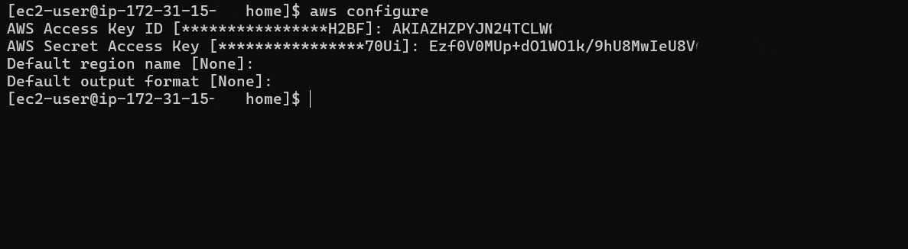
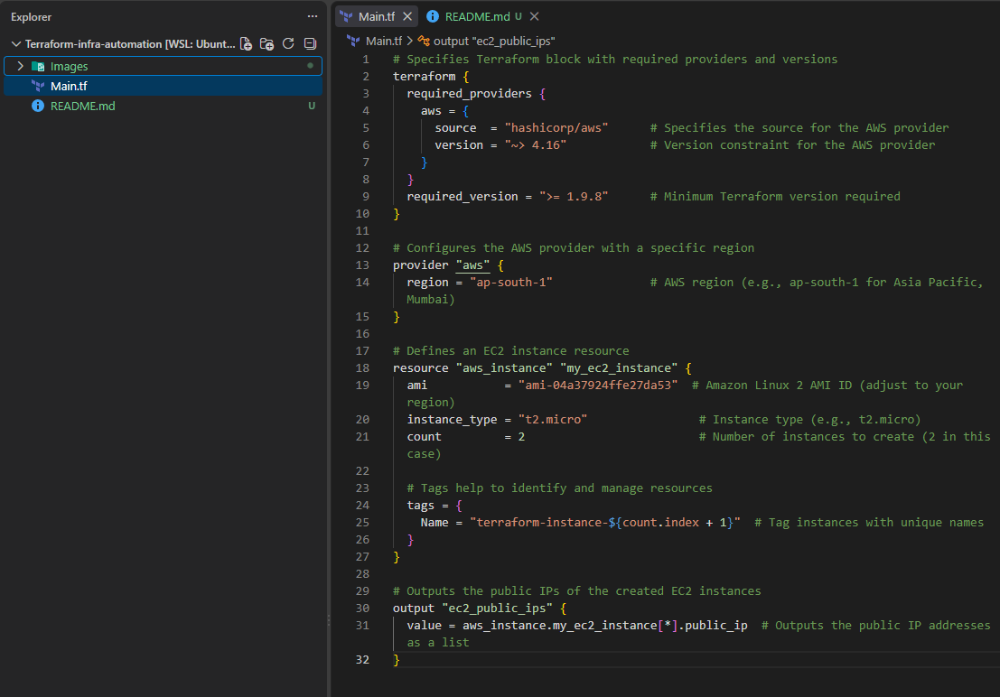
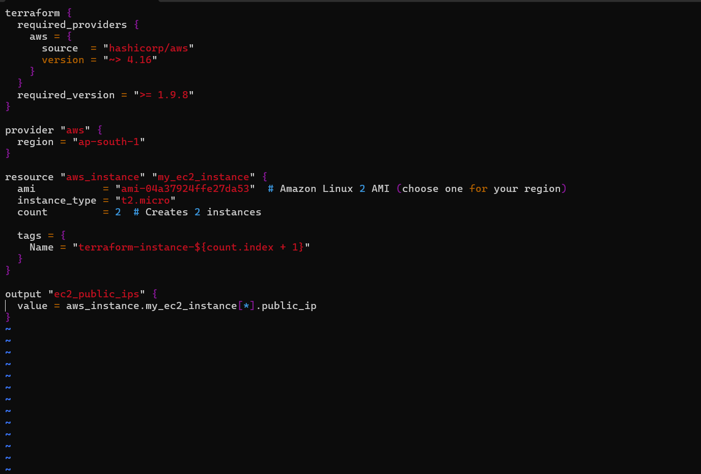
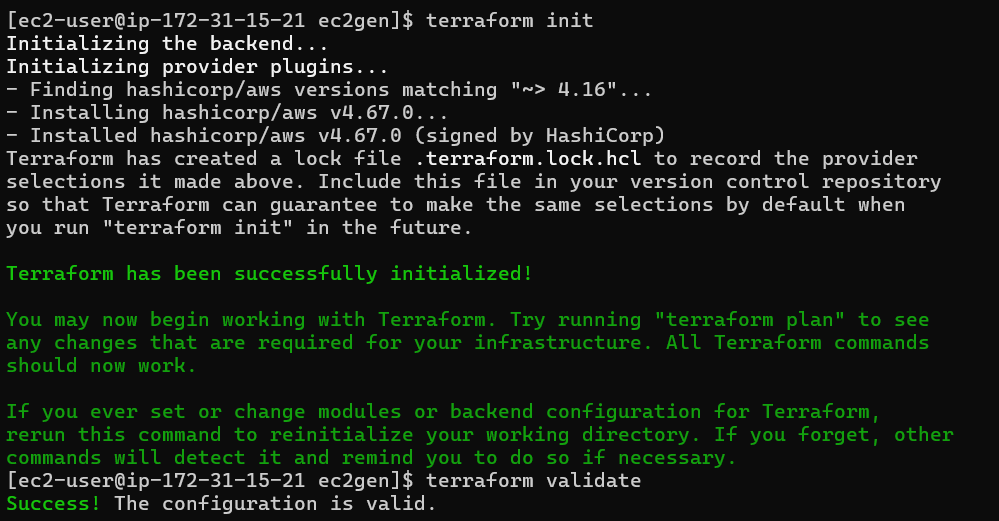
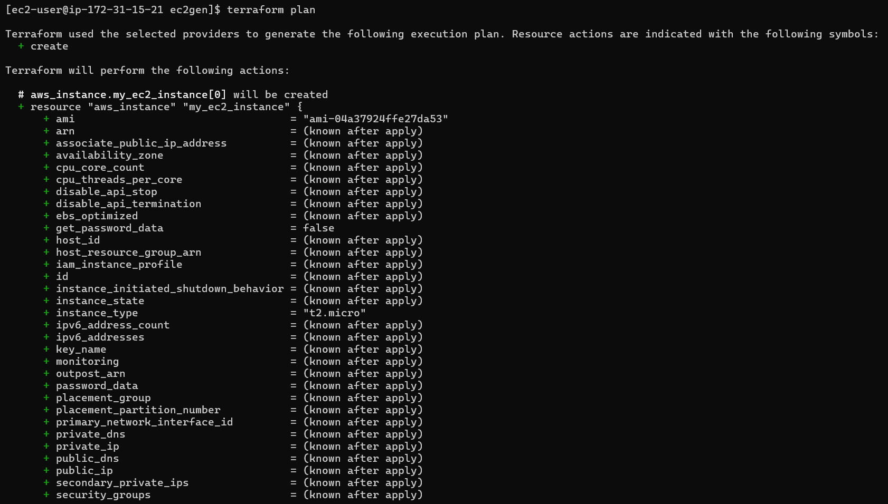
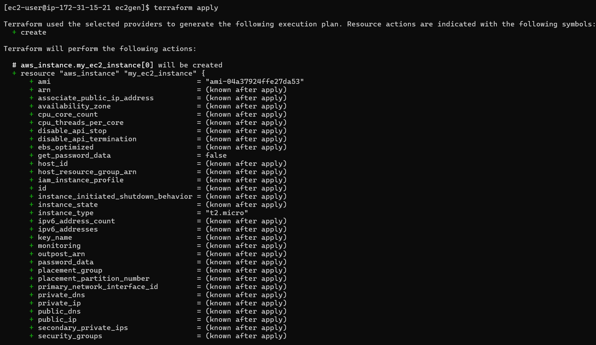
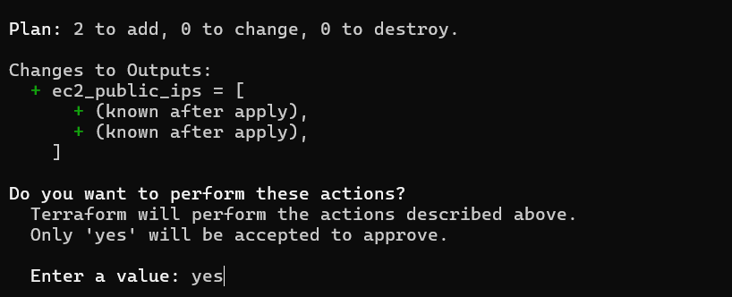
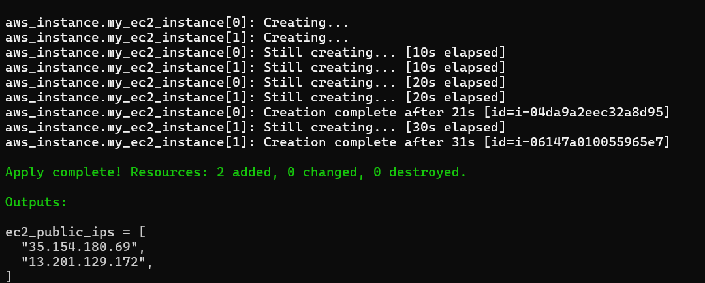
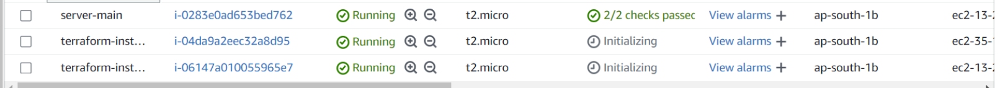

# **Automating EC2 Instance Creation with Terraform**

Hey, devs! Don’t worry, you're at the right place! 😉

If you’ve ever had to create multiple EC2 instances through the AWS dashboard, you know it can be a time-consuming process. But there’s a smarter way: **Infrastructure as Code (IaC)** using Terraform!

With Terraform, we can automate the creation and management of AWS resources, including EC2 instances, making our infrastructure repeatable and manageable with just a few commands. Let me walk you through the setup!

## 🛠 Prerequisites

Before diving into Terraform, make sure you have:

### 1. AWS CLI Configured

The AWS CLI should be set up and configured on your machine with the necessary permissions.

```bash
aws configure # configuring AWS account
```

Enter your access key and secret access key when prompted, and you’re good to go!



### 2. Terraform Installed

Ensure Terraform is installed.

[Terraform Documentation](https://developer.hashicorp.com/terraform/install)

Once these are ready, you’re all set for automation!

## Setting Up Your Terraform Project

First, create a new directory for your Terraform project, which will house all the necessary configuration files.

```bash
mkdir ec2_gen # making a directory
cd ec2_gen
```

Inside this directory, we’ll create a Terraform configuration file that defines our EC2 instances.

## 📝 Writing the Terraform Configuration

Use a text editor to create the `main.tf` file. Here, we’ll define our AWS provider, configure the region, and specify the resource (EC2 instances) we want to create.

```bash
vim main.tf
```

Now, add the following configuration to `main.tf`:

```terraform
# Specifies Terraform block with required providers and versions
terraform {
  required_providers {
    aws = {
      source  = "hashicorp/aws"      # Specifies the source for the AWS provider
      version = "~> 4.16"            # Version constraint for the AWS provider
    }
  }
  required_version = ">= 1.9.8"      # Minimum Terraform version required
}

# Configures the AWS provider with a specific region
provider "aws" {
  region = "ap-south-1"              # AWS region (e.g., ap-south-1 for Asia Pacific, Mumbai)
}

# Defines an EC2 instance resource
resource "aws_instance" "my_ec2_instance" {
  ami           = "ami-04a37924ffe27da53"  # Amazon Linux 2 AMI ID (adjust to your region)
  instance_type = "t2.micro"               # Instance type (e.g., t2.micro)
  count         = 2                        # Number of instances to create (2 in this case)

  # Tags help to identify and manage resources
  tags = {
    Name = "terraform-instance-${count.index + 1}"  # Tag instances with unique names
  }
}

# Outputs the public IPs of the created EC2 instances
output "ec2_public_ips" {
  value = aws_instance.my_ec2_instance[*].public_ip  # Outputs the public IP addresses as a list
}
```



## 🔍 Explanation of the Code

**Provider Block:** This block specifies the AWS provider details, including the region. Make sure to adjust the region if you’re working outside of `ap-south-1`.

**Resource Block:** Here, we define the `aws_instance` resource. The `count` parameter lets us create multiple EC2 instances—in this case, 2 EC2 instances.

**Tags:** We use tags to help identify and manage instances. The name will appear as `terraform-instance-1`, `terraform-instance-2`, and so on.

**Output Block:** This block outputs the public IPs of our newly created EC2 instances, which can be useful for further automation or SSH access.

## 🚀 Running the Terraform Code

With the configuration complete, let’s initialize and apply it. Here’s the sequence of commands you need to run.

### Initialize Terraform

Sets up the working directory and downloads the necessary provider plugins.

```bash
terraform init
```

### Validate the Configuration

Checks for syntax errors or misconfigurations.

```bash
terraform validate
```



### Plan the Deployment

Shows what Terraform will do without making any actual changes. This is a great way to confirm before deploying.

```bash
terraform plan
```





### Apply the Changes

Creates the resources defined in `main.tf`.

```bash
terraform apply
```


During the apply step, Terraform will prompt you to confirm. Type `yes` to proceed.







## 🎉 Verify the Results

Head over to the AWS dashboard and check your EC2 instances. You should see the instances created with the specified tags and configurations. 🚀



## 🧹 Destroy the Infrastructure

Wait, wait, wait...

Created hundreds of instances just for fun and don't know how to terminate them?

Don't do it manually, haha! 😄

Don’t worry! Just use:

```bash
terraform destroy
```

This command will remove all resources defined in your configuration. Thank me later! 😉

## 💡 Bonus Tip

You can choose an Amazon Machine Image by changing the AMI ID in the Terraform configuration.

Make sure the AMI ID you use is available in the AWS region you're deploying to.
